# DIVISIMA

## Description
The primary goal of **DIVISIMA** , an _e-commerce site_ is to sell goods online. This project deals with developing an e-commerce website for **Online Product Sale**. 
It provides the user with a _catalog_ of different product available for purchase in the store. In order to facilitate online purchase a shopping cart is provided to the user. 
The system is implemented using a **3-tier approach**, with a backend database, a middle tier of Microsoft Internet Information Services (IIS) and a web browser as the front end client. _This is a project with the objective to develop a basic website where a consumer is provided with a shopping cart application where he can add desirable products in the cart and buy._ The only _limit_ is the customer can buy the products that are available within the state reach; in other words he can't order products which are from other states. 

## Group No:- 75

## Group Name:- _Magnificent 5_
As a **_team of people_** using technology to make **digital products**,
it's essential to be _unambiguous_ about the _technology/tools_ we use,
so that everyone is clear what we all need to learn/use
to make product(s) that are **_functional, fast, beautiful, useable and reliable!_**

## Group Members:-
1. Aastha Singh - aasthasingh564@bbdu.ac.in
2. Abhishek Gupta - abhi20061997@gmail.com
3. Abhishek Kumar Singh - abhi1211shek@bbdu.ac.in
4. Adil Mahmood Khan - adilk2501@gmail.com
5. Akansha Gautam - akanksha8547@gmail.com
6. Amit Kasera - itsmeamit1111@gmail.com

## Technologies Used:-
 * Platform:- ASP.NET
 * Language:- C#
 * Back-end:- Microsoft SQL Server

## Tools Requirement:-
 * To view the code:- Visual Studio 2019
 * Database:- MsSQL and SSMS(SQL Server Management Studio)

## Assumptions:-
1. Once the user is successfully logged in, he is able to see the list of all the product items that people are selling at his particular City.
2. The user have an option to change the city as well, however, the system restrict the user from buying a product from another state apart from his home state.
3. There is no restriction on checking the list of products available for buying in any city.

## Contributions:-
#### 1. Aastha Singh:-
* Seller login module
* Selling module
#### 2. Abhishek Gupta:-
* Seller Registration module
* Selling module
#### 3. Abhishek Kumar Singh:-
* Cart module
* Order Validation
#### 4. Adil Mahmood Khan:-
* Homepage module
* Buyer Registration module
#### 5. Akansha Gautam:-
* Checkout module
* About module
#### 6. Amit Kasera:-
* Cart module
* Database

## Steps To Execute the Solution (Usage):-
1. Download the Project.
2. Run database file (script.sql).
3. Change connection String in Web.config.
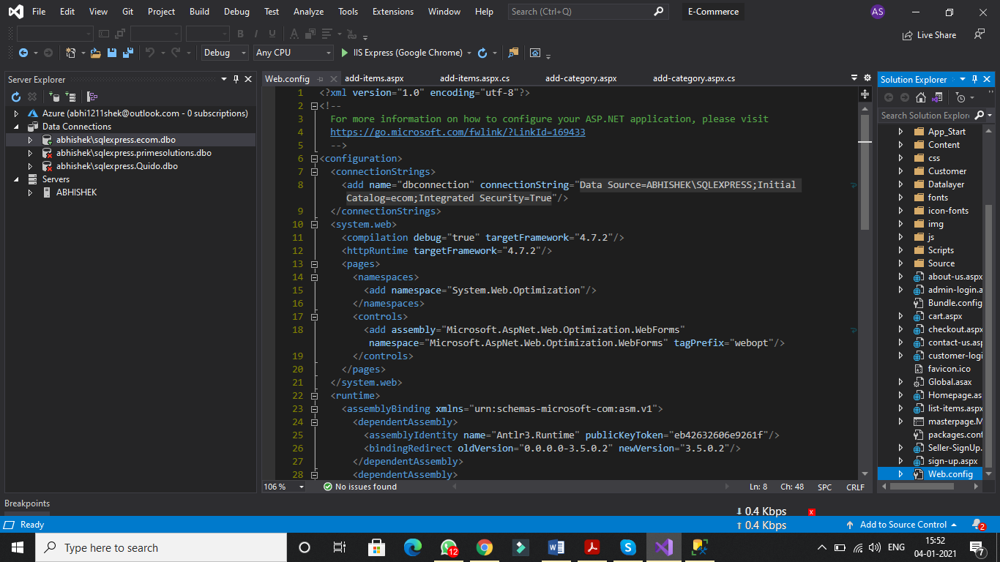
4. Build the Project and start from Homepage.aspx .
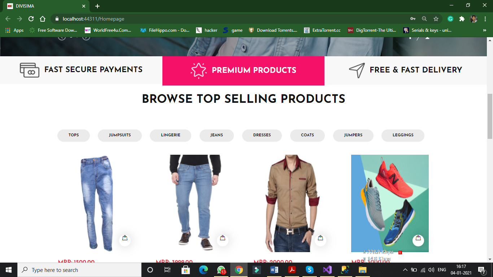
5. Create Seller Account and fill details and get signup.
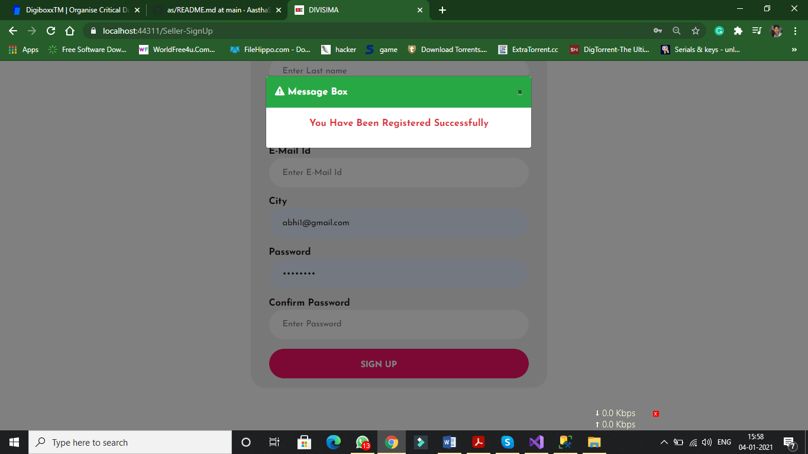
6. Update your Seller Profile.
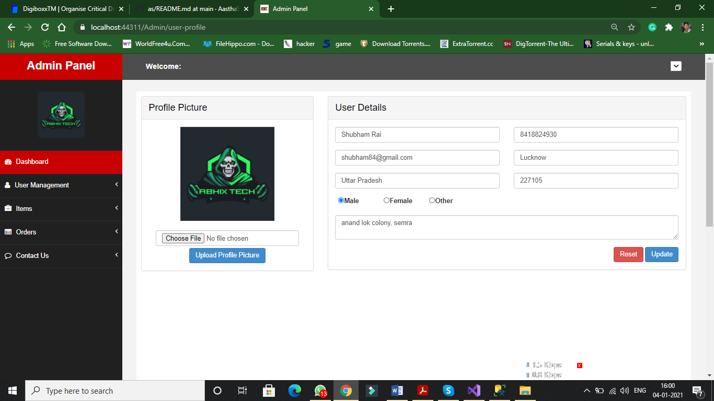
7. Add Item Category Type.
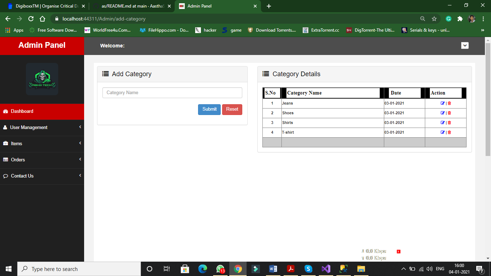
8. Add Item that will show on homepage.
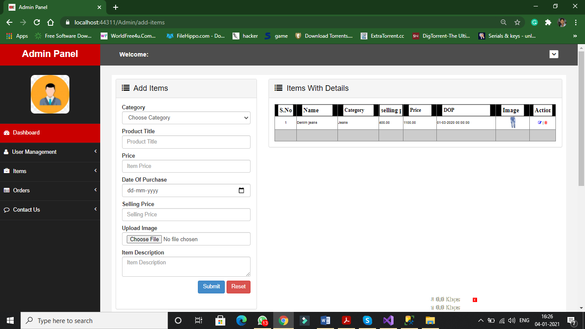
9. See Order details and approve that orders also marked them as delivered.
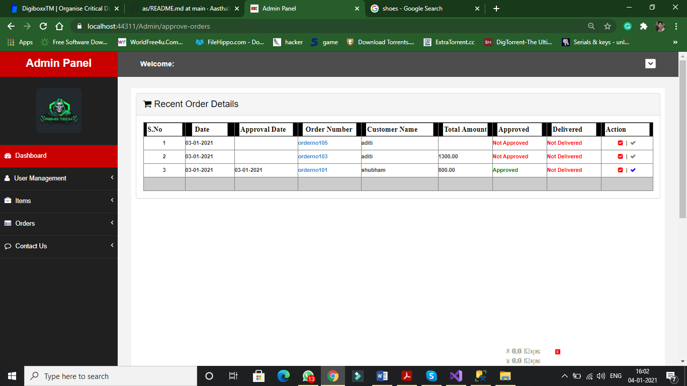
10. Create Buyer Account, fill necessary details and sign up.
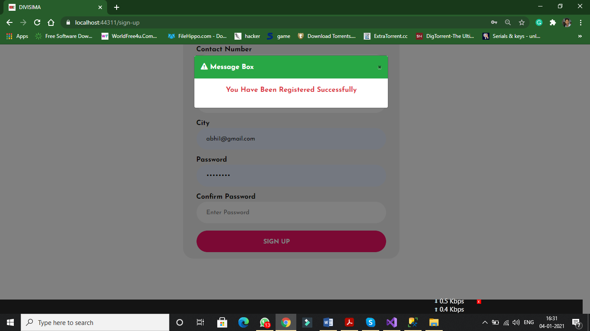
11. Go to items and you can see all the items available for sell but you can purchase only those item that is available in your city.
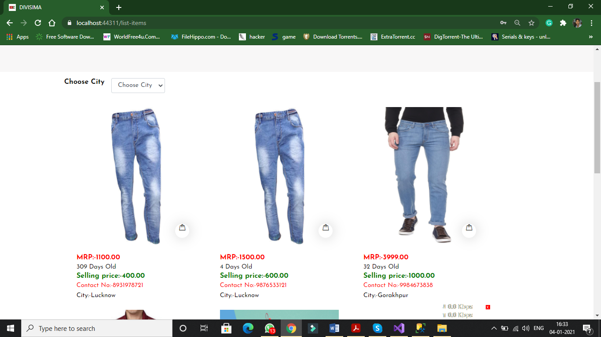
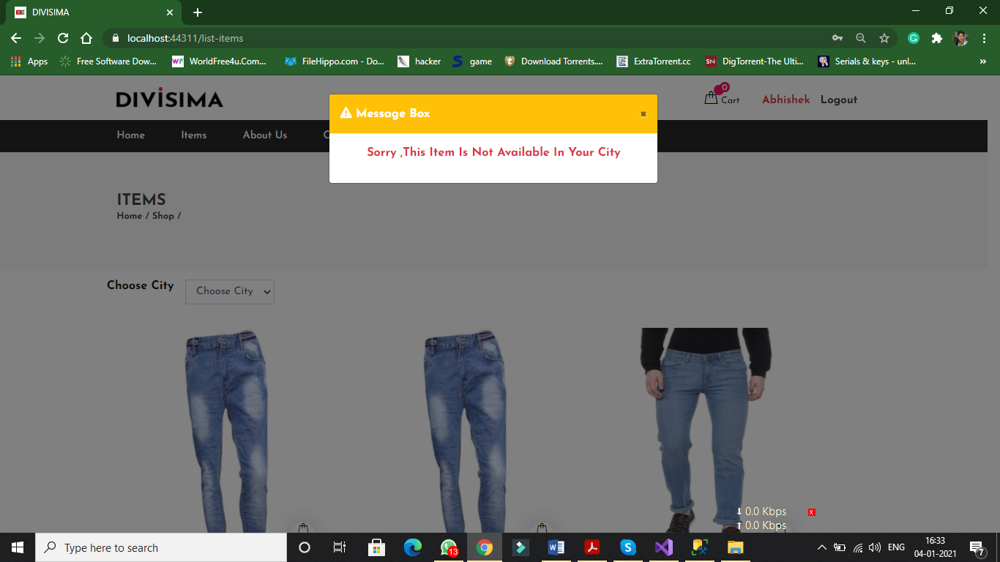
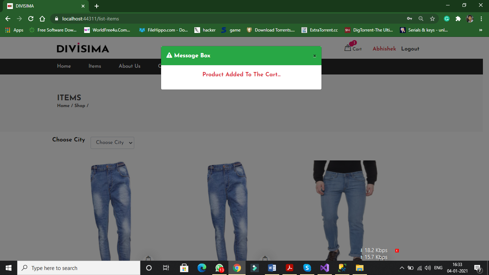
12. Now You are able to place your order.
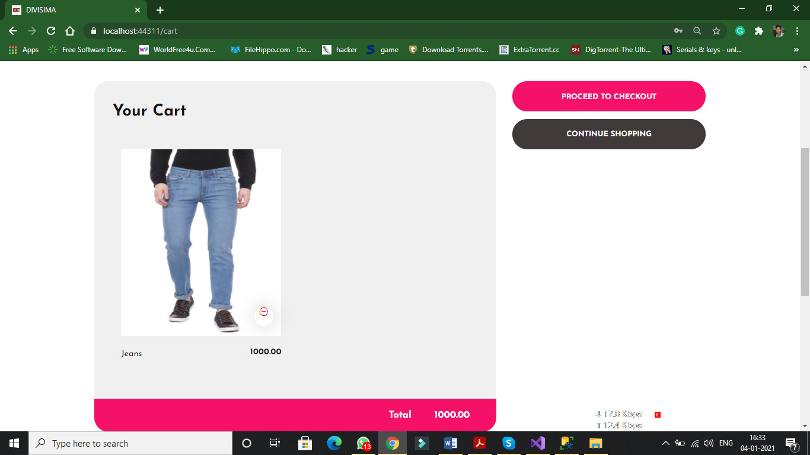
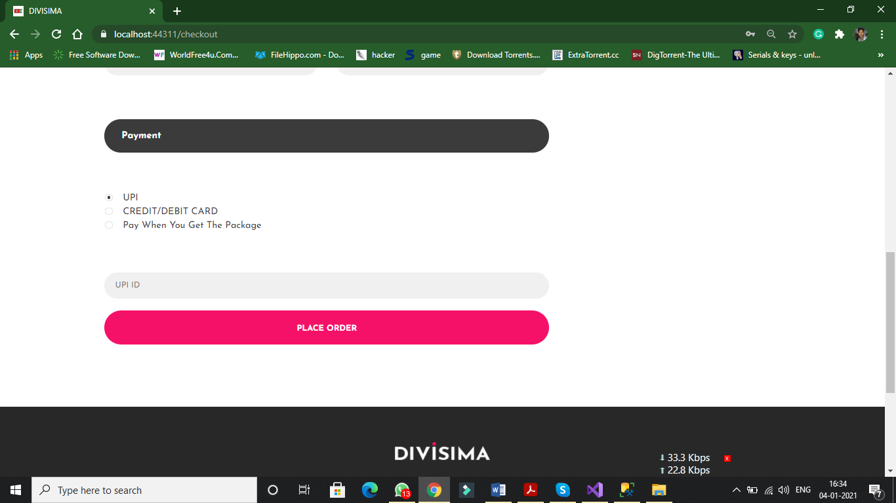
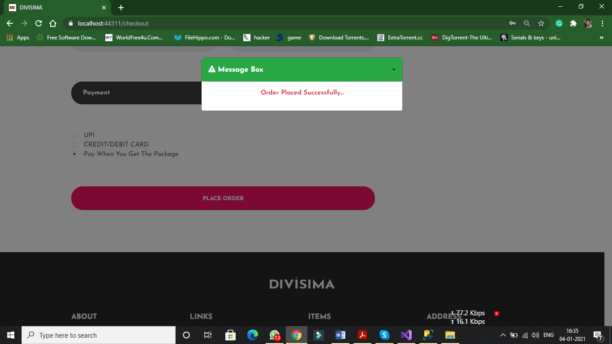
13. You can  see the order details on Orders. 
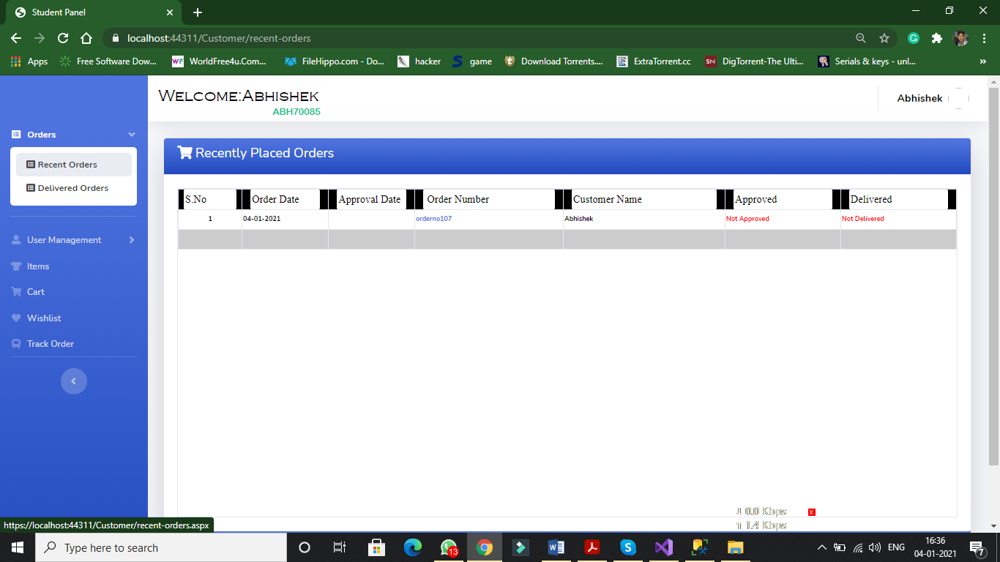
